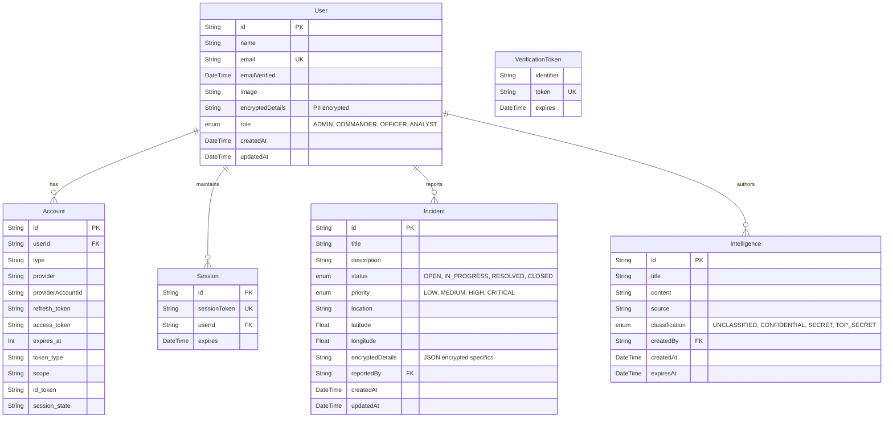

# Entity Relationship Diagram (ERD)

This document visualizes the PostgreSQL database schema for the AI-Powered National Security and Smart Policing Intelligence Platform (NSSPIP).

## Core Architecture

## Security & Encryption Model

* **Zero PII Strategy**: The `User.encryptedDetails` and `Incident.encryptedDetails` fields are stored as `@db.Text` mapped to `String` and contain AES-256-GCM encrypted content (such as phone numbers, detailed suspect descriptors, or precise home addresses) before being written to PostgreSQL.
* **Geospatial Processing**: The `latitude` and `longitude` fields in the `Incident` index allow for rapid clustering and geospatial queries utilized by the AI Engine via PostGIS compatibility mapping.
